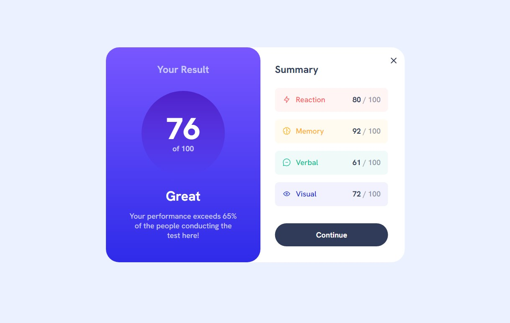

# Frontend Mentor - Results summary component solution

A solution provided by jefflangtech for the [Results summary component challenge on Frontend Mentor](https://www.frontendmentor.io/challenges/results-summary-component-CE_K6s0maV).

This was fun to take a basic component design and add some extra functionality to it.

## Table of contents

- [Overview](#overview)
  - [The challenge](#the-challenge)
  - [Screenshot](#screenshot)
  - [Links](#links)
- [My process](#my-process)
  - [Built with](#built-with)
  - [What I learned](#what-i-learned)
  - [Continued development](#continued-development)
  - [Useful resources](#useful-resources)
- [Author](#author)

**Note: Delete this note and update the table of contents based on what sections you keep.**

## Overview

### The challenge

This component has split sections, with an overall score in one part, and the breakdown of score categories in the second. I adapted the static layout to add some interacivity to it via a slide out section for the score categories. The layout went from horizontal to vertical, switching from desktop to mobile, and it was a little tricky to get the different layouts to exist nicely. Overall fun project!

### Screenshot




### Links

- Solution URL: [Front End Mentor Solution](https://your-solution-url.com)
- Live Site URL: [JeffLangTech Github Sites](https://jefflangtech.github.io/result_component/)

## My process

### Built with

- Semantic HTML5 markup
- CSS custom properties
- Flexbox
- Vanilla JavaScript

### What I learned

I made use of a LOT of CSS custom variables for this project, maybe too many. Looking back I realized, at some threshold for a simple project, it's probably easier just to keep the rules--colors, for instance--in the selector rules instead of having a custom variable for them. In a complex project where that color is being utilized many, many times...sure, it makes a lot of sense.

On the other hand, I was able to do some sizing and layout things, especially with the transforms, that I wasn't sure how else to accomplish. My primary goal was to get the underlying sliding section to come out, doubling the overall width of the component, while keeping the component centered on the page. 

Linking the component width, slide width, and transform state together with custom variables allowed this to occur.

My initial variables:

```css
/* Slide control variables */
  --slide-width: 20.5rem;
  --overlap: 1.75rem;
  --translate-X: -0.95;
```

And the component rules:

```css
.component {
  position: relative;
  height: 28.5rem;
  /* Dynamically sets component width based on top slide, the overlap
  amount, and the visible portion of the bottom slide. This keeps the component in the center of screen even while the slides transition */
  width: calc(2 * var(--slide-width) + var(--overlap) + calc(var(--slide-width) * var(--translate-X)));
  transition-timing-function: cubic-bezier(0.445, 0.05, 0.55, 0.95);
  transition: all 0.55s;
}
```

The JavaScript comes in with the functionality, changing the translateX() value:

```js
const toggleSlide = function() {
  if(!openState) {
    document.documentElement.style.setProperty('--translate-X', '-0.15');
    openState = true;
    toggleButtons();
    resultsScores.style.opacity = "1";
  } else if(openState) {
    document.documentElement.style.setProperty('--translate-X', '-0.95');
    openState = false;
    // Timed to delay the button switch until the slide has returned to a hidden state
    setTimeout(toggleButtons, 550);
    resultsScores.style.opacity = "0";
  }
}
```

### Continued development

Organization and not over-coding are some things I'm working on right now. I'd like to better be able to recognize where patterns exist, especially for styling, and knowing how to structure my CSS file to best accomplish the tasks without spinning out of control.

### Useful resources

Ben Centra - [Bencentra.com](https://bencentra.com/code/2015/02/27/optimizing-window-resize.html) for the critical information to get a visibility bug out. I was losing opacity in certain circumstances on a window resize, and using the window.resize event listener with debounce solved the problem without creating others.

## Author

- Website - [JeffLangTech](https://jefflangtech.github.io/)
- Frontend Mentor - [@jefflangtech](https://www.frontendmentor.io/profile/jefflangtech)
- Twitter - [@jefflangtech](https://www.twitter.com/jefflangtech)
